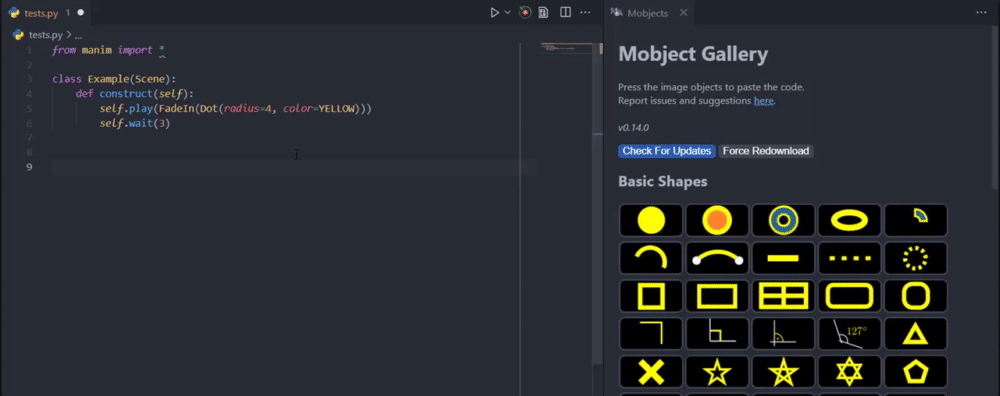

# Manim Sideview

  

A VSCode extension that provides a live preview for rendering and a gallery-based code snippet catalog when working with **[manim](https://raw.githubusercontent.com/ManimCommunity/manim)**. The extension assumes an installation of manim on `PATH` to work. If the executable is not on `PATH` you may set a custom path by following [this guide](#how-do-i-change-the-default-manim-executable-path).

# Index
1. [Quickstart](#quickstart)
2. [The Config File](#config-file)
3. [Rendering The Scene](#rendering)
4. [Mobject Gallery](#mobject-gallery)
5. [Default Configurations](#default-configurations)
6. [FAQs](#frequently-asked-questions)
7. [Credits](#credits)

## Quickstart
Open the file with the scene classes and press the <image src="https://raw.githubusercontent.com/Rickaym/Manim-Sideview/master/assets/images/rotation.png" height="100%" width= "15px"> icon from the menu bar (or) use `Ctrl+'` `r` to immediately start rendering a preview.

<image src="https://raw.githubusercontent.com/Rickaym/manim-sideview/master/images/quickstart.gif">

*That's it, folks!*

## Config File

<image src="https://raw.githubusercontent.com/Rickaym/Manim-Sideview/master/assets/images/dark_logo.png" height="100%" width= "20px"></image>
If you're using a configuration file for your renders, worry not! the extension recognizes any manim configuration under the guideline [manim.cfg](https://docs.manim.community/en/stable/guides/configuration.html#the-config-files) with a few mandatory flags.

P.S. It is necessary to have the config current file in the working directory.

## Rendering

When a scene is successfully rendered for the first time, the extension creates an active job tied to the source file, this ensures persistence in scene names, video directories, and media directories for rendering. You can reset this cache by clicking on the icon.

<image src="https://raw.githubusercontent.com/Rickaym/Manim-Sideview/master/images/statusbaritem.png"></image>

Depending on the execution for rendering, this icon may change also color to green or red for success or failure.

## Mobject Gallery

The Mobject gallery is a web view that allows users to insert code snippets for commonly used manim objects, like squares, text, and also complex graphs.

### How do I open the gallery?
1. Open the command palette using `Shift + Command + P (Mac)` / `Ctrl + Shift + P`
2. Use the command `Manim: Open Mobject Gallery`

You can place the cursor at the desired location and click the image of the manim object to insert the code into a Python file or Jupyter Notebook!

## Default Configurations

The extension requires a few flags such as the `videoDir` and `mediaDir` to be set to load the video file. Using a `manim.cfg` file with these flags makes it explicit, however, in some cases, you might not want to use the configuration file. To get around this issue, you can change the default configurations for the extension rendered through the settings `File -> Preferences -> Settings` to custom values.

1. `manim-sideview.commandLineArgs`
2. `manim-sideview.videoDirectory`
3. `manim-sideview.mediaDirectory`

### Context Variables

These are variables you can use for setting the default configurations.
#### Variables
<table>
<tr>
    <th>Variable</th>
    <th>Description</th>
</tr>
<tr>
    <td>{module_name}</td>
    <td>The name of the file being run.</td>
</tr>
<tr>
    <td>{media_dir}</td>
    <td>The directory of the media files.</td>
</tr>
<tr>
    <td>{scene_name}</td>
    <td>The name of the scene being run.</td>
</tr>
</table>

Using unset variables will result in default values being used.

## Frequently Asked Questions
1. [How do I render on save?](#1-how-do-i-render-on-save)
2. [How do I change the scene name after running?](#2-how-do-i-change-the-scene-name-after-running)
3. [How do I change the default manim executable path?](#3-how-do-i-change-the-default-manim-executable-path)

### 1. How do I render on save?

Enable the `manim-sideview.runOnSave` settings inside vscode `File -> Preferences -> Settings` menu.

<image src="https://raw.githubusercontent.com/Rickaym/Manim-Sideview/master/images/settings_runonsave.png"></image>

### 2. How do I change the scene name after running?

You can change the scene name after a job by using the `Manim: Set A New SceneName` command through the command palette `Shift + Command + P (Mac)` / `Ctrl + Shift + P`.

Alternatively, you can also use the following default hotkey `Ctrl + '` `c`.

### 3. How do I change the default manim executable path?

You can set the default manim executable path by changing the `manim-sideview.defaultManimPath` configuration in `File -> Preferences -> Settings`.

<image src="https://raw.githubusercontent.com/Rickaym/Manim-Sideview/master/images/settings_defaultmanimpath.png"></image>

### Known Issues

... None

## Changelog

#### 0.0.14

+ Extension terminal output format changed & added message persistence 
+ Video Player renamed to "Media Player" and now handles both image and video media 
+ Added image support for rendering previews 
+ New GUI User Interface for the Media Player 
+ Uses the `plywood-gallery-for-vsce` template engine for Mobject Gallery 
+ Uses the `plywood-gallery-for-vsce` template engine for Media Player 
+ Added a new output channel called `Manim Sideview` for the extension to log all window and debug information 
+ README write simplification and rewrite 
+ Added support to rendering scenes without loading the source file workspace 
- Fontawesome CSS and JS files removed 
- Extension excess terminal output removed 
+ Changed command `manim-sideview.setRenderingSceneName` name to `manim-sideview.renderNewScene` 
+ Added command `manim-sideview.showOutputChannel` command for opening the log output channel 

#### 0.0.13

+ Optional Terminal Output 
+ Jupyter Notebook Fix 
+ Webview URI error fix 

#### 0.0.12

+ Added configurations to disable or enable auto-play
+ Added configurations to disable or enable looping

#### 0.0.11

+ Patched the local incorrect version file path for mobject gallery

#### 0.0.10

+ Run-time configuration settings can be set for jobless scenes where it'll create a new job for the user
+ Changed default quality mappings with responsiveness to Manim 0.13.1
+ Smarter manim.cfg file analysis and in determining context
* It should be noted that default rendering will still use `-ql` for backward compatibility
+ Added manim version re-synchronization command for developer independent compatibility
+ Added version signifier to the mobject gallery

#### 0.0.9

+ Scene scanner now looks for all class definitions with subclasses with name Scene in them
+ Better responsiveness for refocusing selected documents in mobject gallery

#### 0.0.8

+ Using axios now to synchronize assets for better performance

#### 0.0.7

+ Added force re-download when assets are damaged

#### 0.0.6

+ Added video player configurations `previewProgressColor`, `previewShowProgressOnIdle`
+ Added `Check For Updates` button in mobject gallery and a sync lock with the repo

#### 0.0.5

+ Fixed server links
+ Added `manim-sideview.showMobjectGallery`
+ Added hide progress button
+ Added debrief for the video

#### 0.0.4

+ Minor bug fix for Unix machines with trimmed leading slashes

#### 0.0.3

+ Added `manim-sideview.stop` for stopping any running processes
+ Paths are now normalized to work with both forward and backward slashes
+ video directories are now static and will not depend on the verdict of manim
+ Setting a valid path no longer replies with "Success" because this can be confusing when there is an exception thrown later down the line that has nothing to do with the scene name
+ `manim.cfg` files are now derived from the working path - which is the correct case
+ Added support server link

#### 0.0.1 - 0.0.2

The initial release of Manim Sideview.

## Credits

Icons made by <a href="https://www.flaticon.com/authors/smashicons" title="Smashicons">Smashicons</a> and <a href="https://www.freepik.com" title="Freepik">Freepik</a> from <a href="https://www.flaticon.com/" title="Flaticon">www.flaticon.com</a>, [mobject gallery](https://github.com/kolibril13/mobject-gallery/) by [kolibril13](https://github.com/kolibril13) and ofcourse the logo by the [manim](https://raw.githubusercontent.com/3b1b/manim)/[community](https://raw.githubusercontent.com/ManimCommunity/manim/) project themselves!

**Made with <3 by Ricky,**
