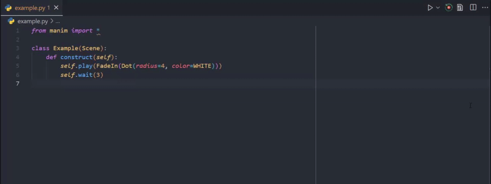

# Manim Sideview

An extension for Visual Studio Code that provides a live preview and various other features in working with **[manim](https://raw.githubusercontent.com/ManimCommunity/manim)**.

## Index

1. [Rendering](#rendering)
2. [Moject Gallery](#mobject-gallery)
3. [Context Variables](#context-variables)
4. [Extension Settings](#extension-settings)
5. [Status Bar Item](#utilities)
6. [Credits](#credits)

## Rendering

Before you can start a live preview you'll have to setup a few configuration settings for rendering! As well as the media path. This is because the extension combines the sideview and the file execution into a single workflow, read further ~

*The final Product!*

Upon opening any Python files, you'll see an icon pop up in the menu bar that looks like this
<image src="https://raw.githubusercontent.com/Rickaym/Manim-Sideview/master/assets/images/rotation.png" height="100%" width= "20px"></image>. The file will be executed and rendered using manim under appropriate configurations when clicked. You can also use the hotkey which is set to by default `ctrl + '` `r` *press, release and then press r, this is not simultaneous*.

Whenever a file is run successfully for the first time, the extension creates a dedicated job tied to the source file, you can look at [this](#utilities) to make sure - as long as this job is active, all your settings will persist. Note that run on save does not get activated on files that don't have jobs.

#### Configuration

It can be done in two ways.

<image src="https://raw.githubusercontent.com/Rickaym/Manim-Sideview/master/assets/images/settings.png" height="100%" width= "20px"></image> The first option is to provide in a runtime/in time (can be used interchangeably) configuration - where we'll ask you a few questions to tweak the settings on run time

**HOTKEY** - `ctrl + '` `s` *press, release and then press s, this is not simultaneous*

<image src="https://raw.githubusercontent.com/Rickaym/Manim-Sideview/master/assets/images/dark_logo.png" height="100%" width= "20px"></image> For the second option you'll have to configure a `manim.cfg` with a few mandatory flags. Importantly, you must have the config file in the working directory.

#### Preview

To serve a live preview, the extension needs a relative path to the media file (it can be absolute for an intime configuration).

Those using a `manim.cfg` file can skip this part as we derive programmatically where the media file will be with the given flags.

For those using the runtime configurations, you'll have to provide the media path in the same dialog. When doing so, you can use a few context variables with as privillege as you can when changing the settings as provided [here](#variables).

<image src="https://raw.githubusercontent.com/Rickaym/Manim-Sideview/master/images/video_dir.png"></image>
* *figure taken from the in time configuration menu*

#### On Save

Configuring your manim projects to execute on save is very easy, just enable the `manim-sideview.runOnSave` settings inside vscode `File -> Preferences -> Settings` menu. This is disabled by default.

## Mobject Gallery

**A mobject gallery for inserting mobjects**

Open the gallery by the vscode command palette `Show Mobject Gallery For manim` and click on the shape that you want to use.
 It will appear in your code editor (either in a python or jupyter file).

## Context Variables

Sometimes we don't want to set an absolute path to the media file. Context Variables can only be used in:
* Configuration of `manim-sideview.videoFilePath`
* In time configurations `Video Directory` option

The case of variable names matter.
#### Variables
<table>
<tr>
    <th>Variable</th>
    <th>Description</th>
</tr>
<tr>
    <td>{module_name}</td>
    <td>The name of the file being run.</td>
</tr>
<tr>
    <td>{media_dir}</td>
    <td>The directory of the media files.</td>
</tr>
<tr>
    <td>{scene_name}</td>
    <td>The name of the scene being run.</td>
</tr>
</table>

Using unset variables will result in default values being used.

## Extension Settings

**Contemporary settings**

1. After starting a job, you can change the scene name between executions. This can be done by using the command `manim-sideview.setRenderingScene` through pressing `F1` and searching it up - or use the hotkey by default set to `ctrl + '` `c`. This prompt looks exactly like the one shown whenever you start an execution process.

2. When running a job using in time configurations you can change it anytime by resetting it. You can reset it by calling the command `manim-sideview.setInTimeConfiguration` through pressing `F1` and searching it up. This will bring up a webview if you have an active job that allows resetting.

**Application or default settings**
<table>
<tr>
    <th>Identifier</th>
    <th>Description</th>
    <th>Default</th>
</tr>
<tr>
    <td> manim-sideview.defaultManimPath </td>
    <td>The absolute path to the manim executable.</td>
    <td>manim</td>
</tr>
<tr>
    <td> manim-sideview.commandLineArgs </td>
    <td> The command line arguments in rendering manim. Refer to https://docs.manim.community/en/stable/tutorials/configuration.html?highlight=configuration#a-list-of-all-cli-flags for existing arugments. </td>
    <td>-ql</td>
</tr>
<tr>
    <td>manim-sideview.videoDirectory</td>
    <td>The video output directory. We can use context variables here to place them under the media directory. This does not include the `.mp4` file itself.</td>
    <td>{media_dir}/videos/{module_name}/480p15</td>
</tr>
<tr>
    <td>manim-sideview.mediaDirectory</td>
    <td>The root folder for all media output.</td>
    <td>media</td>
</tr>
<tr>
    <td>manim-sideview.runOnSave</td>
    <td>Whether to run on save for a file that has been run before.</td>
    <td>false</td>
</tr>
<tr>
    <td>manim-sideview.focusOutputOnRun</td>
    <td>Whether to focus on the output log when running.</td>
    <td>true</td>
</tr>
</table>

## Utilities

You can find a status bar item inside the status bar (the one at the very bottom) an icon that looks like:

<image src="https://raw.githubusercontent.com/Rickaym/Manim-Sideview/master/images/statusbaritem.png"></image>

Note that this is a visual reminder that the file in current focus has an active job. Relevantly, this icon will change colors to either green or red depending on the results of an execution at times.

### Known Issues

_-_

#### 0.0.1 - 0.0.2

Initial release of Manim Sideview.

#### 0.0.3

+ Added `manim-sideview.stop` for stopping any running processes
+ Paths are now normalized to work with both forward and backward slashes
+ video directories are now static and will not depend on the verdict of manim
+ Setting a valid path no longer replies with "Success" because this can be confusing when there is an exception thrown later down the line that has has nothing to do with the scene name
+ `manim.cfg` files are now derived from the working path - which is the correct case
+ Added support server link

#### 0.0.4

+ Minor bug fix for Unix machines with trimmed leading slashes

#### 0.0.5

+ Fixed server links
+ Added `manim-sideview.showMobjectGallery`
+ Added hide progress button
+ Added debrief for the video

---

## Credits

Icons made by <a href="https://www.flaticon.com/authors/smashicons" title="Smashicons">Smashicons</a> and <a href="https://www.freepik.com" title="Freepik">Freepik</a> from <a href="https://www.flaticon.com/" title="Flaticon">www.flaticon.com</a>, [mobject gallery](https://github.com/kolibril13/mobject-gallery/) by [kolibril13](https://github.com/kolibril13) and ofcourse the logo by the [manim](https://raw.githubusercontent.com/3b1b/manim)/[community](https://raw.githubusercontent.com/ManimCommunity/manim/) project themselves!

**Made with <3 by Ricky,**
